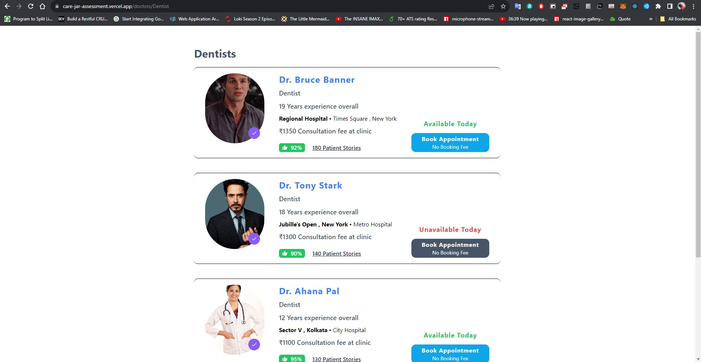
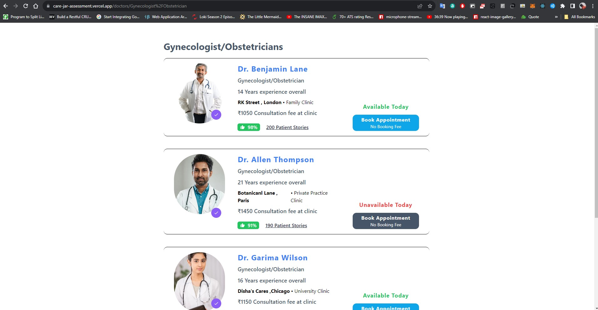
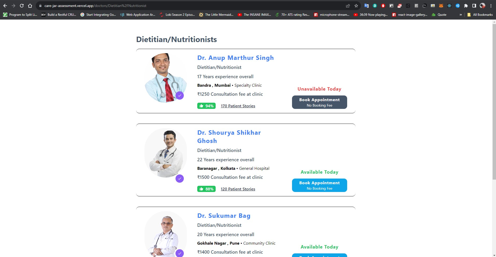

<h1 align='center'>CareJar Assignment</h1>

<h3 align='center'>This is the Client-side Repository</h3>

### Tech Stack  🛠 

- [Backend Server Repository](https://github.com/soumyarajbag/CareJar-Server) with [Deployed Server on Vercel](https://care-jar-server.vercel.app/) 

## <h3 align='center'> UI of  CareJar Assignment </h3>

## <h3 align='center'> Project Approach </h3>
- Initialised A React Project with TypeScript Template using Vite .
- Set up the Environment with TailwindCSS and Required Types of All Modules .
- Created Components Folder and Created <b>DoctorCard</b> and <b>CategoryCard</b> .
- Created Pages Folder with <b>CategoryPage<b> and <b>DoctorsPage<b> .
- Tested The Mapping with Dummy Data copied from Internet Fake APIs and Generated by ChatGPT .
- Initialised Backend Server and Created Models of <b>Specialists(Categories)</b> and <b>Doctors</b> .
- Created Total 4 Controllers for Each , For Doctors : <b>getDoctors(GET) , addDoctor(POST) , getDoctorsbyRole(GET) , updateDoctorsbyId(PUT) , deleteDoctorbyId(DELETE)</b>
- For Specialists : <b>getSpecialists(GET) , addSpecialist(POST) , updateSpecialistsbyTitle(PUT) , deleteSpecialistsbyTitle(DELETE)</b>
- For Doctors API : <a href="https://care-jar-server.vercel.app/api/doctors">Click Here</a>
- For Specialists API : <a href="https://care-jar-server.vercel.app/api/specialists">Click Here</a>
- Deployed The Backend Repository in Vercel and Fetch The Data using Axios Library in Frontend from Deployed API Link .
