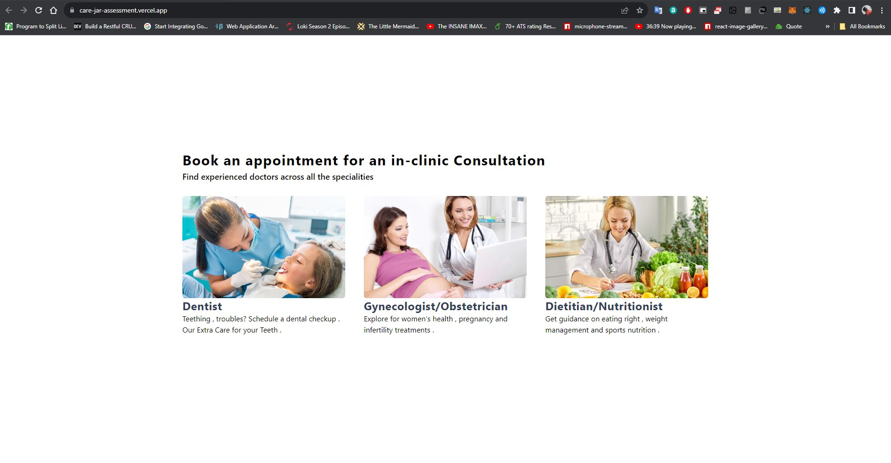

<h1 align='center'>CareJar Assignment</h1>

<h3 align='center'>This is the client-side repository</h3>

### Languages 🛠 
[](https://skillicons.dev)

- [Backend Server Repository](https://github.com/soumyarajbag/CareJar-Server) with [Deployed Server on Vercel](https://care-jar-server.vercel.app/) 


## <h3 align='center'> Sample UI of our stockXplore Web-App </h3>
<p align='center'>



<p>

If you are developing a production application, we recommend updating the configuration to enable type aware lint rules:

- Configure the top-level `parserOptions` property like this:

```js
export default {
  // other rules...
  parserOptions: {
    ecmaVersion: 'latest',
    sourceType: 'module',
    project: ['./tsconfig.json', './tsconfig.node.json'],
    tsconfigRootDir: __dirname,
  },
}
```

- Replace `plugin:@typescript-eslint/recommended` to `plugin:@typescript-eslint/recommended-type-checked` or `plugin:@typescript-eslint/strict-type-checked`
- Optionally add `plugin:@typescript-eslint/stylistic-type-checked`
- Install [eslint-plugin-react](https://github.com/jsx-eslint/eslint-plugin-react) and add `plugin:react/recommended` & `plugin:react/jsx-runtime` to the `extends` list
